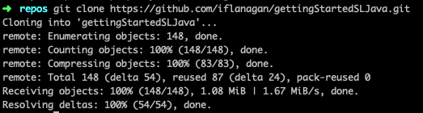
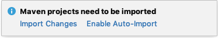

Pre-requisities:

- valid sauce labs account
- Java 1.8
- maven plugin for intellij

#### Create or move to directory to clone code
```
mkdir <yourdirectoryname>
```

#### Clone code


```
git clone https://github.com/iflanagan/gettingStartedSLJava.git
```

#### Open IntelliJ and Import as Maven Project
click on import project
browse to the directory cloned location
click open
click on import project from external model
select maven
click finish

when you see the pop-up in the bottom right 'maven projects need to be imported' click on 
'Enable Auto-import'



*OR* 
right+click on POM.xml on right Project Pane and Import Maven Project 

#### WebTest.Java

In the top left click on the project link so you can see the project structure

- click and open the `src/main/java/WebTest.java` file 

    here should be no errors.  If you encounter errors, click on Build Project  at the top 
    

Sample Error:
- When running  indicating you need to Build Project:


- Red lines in WebTest file indicating we'remissing dependencies 

#### Note: there should be no errors.
#### Note: Do not hardcode/commit saucelabs credentials. Use [environment variables](https://wiki.saucelabs.com/display/DOCS/Best+Practice%3A+Use+Environment+Variables+for+Authentication+Credentials).

-------
Steps to run EmulatorExampleNative.java file

- Download the Calculator_2.0.apk app

- change the following line in the Constants class 

public static String myFile = "/Users/ianflanagan/Downloads/Calculator_2.0.apk";

to point to where you downloaded the file.

- set your sauceusername and sauceaccesskey in the Constants.java file

- right click in intellig and run the program

MORE information on how to run tests on emulators/simulators on the sauce platform can be found here

https://wiki.saucelabs.com/display/DOCS/Platform+Configurator#/ (click on appium and then select emulator/simulator)

